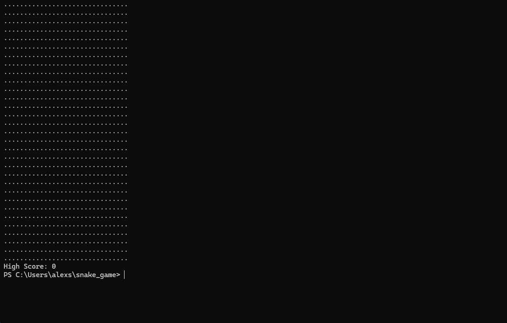

# Snake Game com Rust
Este projeto foi criado com o objetivo de desenvolver minha lógica de programação e aprofundar meus conhecimentos na linguagem de programação Rust e o uso de bibliotecas externas do rust

## Conceitos aplicados
- 🏠 **Ownership e Barrowing**: O Rust funciona alocando espaços na memória que são apenas deles próprios e para que seja possível usar esses espaços alocados para funções ou outras váriaveis para receberem o mesmo valor, é preciso emprestar. Um exemplo interessante é como se seu código Rust fosse um condomínio fechado com cada váriavel sendo dona de seu próprio apartamento, outras variáveis não podem entrar sem pedir a permissão da variável dona do apartamento, e quando isso ocorre, por "bons modos" a variável dona não poderá modificar seu apartamento até que a variável estrangeira deixe seu apartamento.
- 🖩 **Patterns Matting**: Em outras linguagens, sua aproximação mais semelhante é o ```Switch/case```, em rust é chamado de ```match```, sendo esse uma versão muito mais poderosa, podendo conter valores diferentes para tipos de dados semelhantes e declarar funções inteiras dentro de seu escopo.
- ❌ **Result e Option**: No Rust, os conceitos de entrada de váriaveis e conversão devem ser feitos utilizando os ```.unwrap()```, ```.expect()``` ou até mesmo o ```match``` para capturar possíveis erros, sendo este uma versão do catch para vriaveis.
- 📏 **Vetores**: Vetores são de ultima análise, um tipo de array em Rust, sendo estes sua variante dinâmica sem um tamanho pré-definido, são declaradas como ```vec![]```, sua tipagem pode ser ou não definida, caso não seja definida na hora da declaração da váriavel, será inferida baseada no primeiro elemento.
- 🔁 **loop**: São uma forma while porém sem a necessidade de uma comparação, podendo ser infinito, seu conceito pode ser copiado em outras linguagens como ```while(true)```.
- 🗺️ **enum**: São um determiado tipo agrupamento de outros tipos diferentes para uma variável, sendo um conceito mais amplo que o uso de ```struct```, podendo conter tipos de dados diferentes um dos outros sem a necessidade de declarar váruios ```struct```, uma forma semelhante em outras linguagens são as interfaces que mapeiam determinados tipos de uma váriavel.

## Bibliotecas usadas
- 🎲 **Rand**: Biblioteca para geração de valores aleatórios.
- 📓 **io**: É uma biblioteca padrão do Rust para entrada de variáveis.
- ⬆️⬇️⬅️➡️ **Crossterm**: Biblioteca para captura de macros das teclas e manipulação do terminal.
- 💤 **thread**: Biblioteca padrão do Rust, permite configuração de multithreading, pausa no código, entre outros.
- ⌛ **time**: Outra biblioteca padrão do Rust, usada para definir um determinado periodo, normalmente usado junto a sleep para definir um periodo de pausa.

## Como foi feito
1. **Criação do Grid**: O primeiro objetivo foi fazer um tabuleiro de 31x31 utilizando um array fixo e enums para determinar cada tipo de célula da grid e então exibila como uma grid pontilhada:


2. **Criando a cobrinha**: Para criar a cobrinha, foi feito usando um vetor de tamanho variavem que era renderizado dentro da array fixa da grid por um enum de ```Cell::Snake``` junto a um random da posição da fruta na grid.


3. **Adicionanando movimento**: Adição do movimento da cobrinha pela grid a partir de um input do teclado padrão de uma biblioteca do Rust chamada io. (não gravei essa parte)

4. **Aplicando movimento ao vivo**: Considero a parte mais díficil, retirar o rastro da cobrinha e capturar o movimento ao vivo das setas de flecha do teclado.


## Como aplicar esse projeto
Se deseja apenas ver o projeto funcionando, apenas basta baixar o executavel do projeto [Snake Game](./target//release//snake_game.exe).

Caso não tenha confiança nesse arquivo, faça os seguintes passos:

1. Faça o clone do projeto ```https://github.com/Alexsandro-J-Ludwig/snake_game```
2. Tenha instalado o Rust em seu desktop, caso não tenha, instale por aqui: [Instalador Rust](https://rust-lang.org/pt-BR/learn/get-started/) (instale junto do visual studio).
3. Vá para o diretorio do projeto usando o comando ```cd <caminho_do_projeto>```.
4. Em seguida rode o código ```cargo build --release```.
5. Você criou o memo executavel que ofereci para instalação acima, para rodar seu executavel cole ```.\target\release\snake_game.exe```. e seu joguinho vai rodar.

